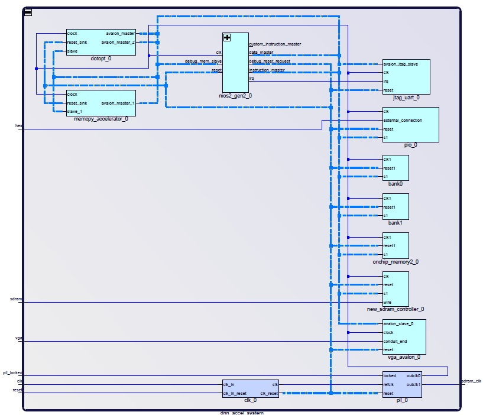

# FPGA Neural Network Accelerator

Q16.16 fixed-point neural network accelerator implemented on the Intel DE1-SoC FPGA. The project combines custom hardware accelerators, on-chip memory optimization, and a Nios II System-on-Chip (SoC) platform to accelerate neural network inference for MNIST handwritten digit classification.

---

## Overview

This project explores the design and implementation of a hardware-accelerated neural network inference system on FPGA. The design integrates custom SystemVerilog accelerators with a Nios II soft-core processor, external SDRAM, and on-chip SRAM to efficiently perform matrix-vector computations commonly found in deep neural networks.

The accelerator offloads computationally intensive operations from the processor and leverages fixed-point arithmetic and memory reuse techniques to improve performance. The complete system was implemented, synthesized, and validated on the Intel DE1-SoC FPGA platform.

---

## System Architecture



The accelerator is integrated into a Nios II System-on-Chip architecture built using Intel Platform Designer (Qsys). The system combines a custom fixed-point dot-product accelerator, a dedicated memory transfer engine, external SDRAM, and on-chip SRAM connected through Avalon memory-mapped interfaces.

The Nios II processor coordinates neural network execution while computationally intensive matrix-vector operations are offloaded to custom hardware accelerators. On-chip memory is used to cache activation data and reduce external memory accesses, improving throughput through data reuse.

---

## Architecture

The system is built around a custom fixed-point dot-product engine integrated into a Nios II SoC platform. Neural network weights, activations, and intermediate results are stored in external SDRAM and accessed through Avalon memory-mapped interfaces.

To improve performance, the design incorporates dedicated hardware for memory transfers and on-chip SRAM buffers that cache frequently accessed activation data. This reduces external memory traffic and improves accelerator throughput through data reuse.

The resulting architecture combines software control running on the Nios II processor with custom FPGA hardware accelerators to efficiently execute neural network inference workloads.

---

## Accelerator Components

### Memory Transfer Engine

A custom DMA-style memory transfer engine enables bulk movement of data between memory regions without continuous processor intervention.

**Features**

* Avalon master/slave interfaces
* SDRAM read/write support
* Hardware-managed memory transfers
* Reduced processor overhead

### Fixed-Point Dot Product Engine

The core computation engine performs Q16.16 fixed-point dot-product operations used in neural network inference.

**Features**

* Fixed-point multiply-accumulate datapath
* Hardware acceleration of matrix-vector operations
* Avalon memory-mapped control interface
* External memory operand fetching

### Optimized Memory Architecture

To improve throughput, the accelerator utilizes on-chip SRAM buffers to cache activation data and reduce repeated SDRAM accesses.

**Features**

* Activation reuse optimization
* On-chip buffering
* Reduced memory bandwidth requirements
* Concurrent memory access architecture

---

## Key Features

* FPGA-based neural network acceleration
* Q16.16 fixed-point arithmetic
* Custom Avalon IP development
* Hardware/software co-design
* Nios II SoC integration
* SDRAM and SRAM memory hierarchy
* DMA-style memory transfer engine
* Matrix-vector acceleration
* Memory reuse optimization
* MNIST digit classification inference

---

## Implementation Results

| Metric            | Value                     |
| ----------------- | ------------------------- |
| FPGA Platform     | Intel DE1-SoC (Cyclone V) |
| Logic Utilization | 1,490 ALMs                |
| Registers         | 1,919                     |
| Memory Usage      | 492,672 bits              |
| RAM Blocks        | 66                        |
| DSP Blocks        | 3                         |
| PLLs              | 2                         |
| Worst Setup Slack | 11.619 ns                 |
| Worst Hold Slack  | 0.120 ns                  |
| Timing Closure    | Passed                    |

---

## Verification and Validation

The design was validated through Quartus compilation, timing analysis, Platform Designer integration, and FPGA implementation on the Intel DE1-SoC platform.

Functional validation focused on hardware synthesis, timing closure, and successful integration of custom accelerators within the Nios II SoC architecture. The final implementation met timing requirements and successfully fit within the target Cyclone V FPGA resources.

---

## Technologies Used

### FPGA Development

* Intel DE1-SoC FPGA
* Intel Quartus Prime
* Intel Platform Designer (Qsys)

### Hardware Design

* SystemVerilog
* RTL Design
* Finite State Machine Design
* Fixed-Point Arithmetic

### Embedded Systems

* Nios II Soft Processor
* Avalon Memory-Mapped Interfaces
* SDRAM Controllers
* On-Chip SRAM

### Verification

* Quartus Timing Analyzer
* Resource Utilization Analysis
* Hardware Validation

---

## Repository Structure

```text
fpga-neural-network-accelerator/
├── data/
│   └── MNIST test data and neural-network parameter files
├── reports/
│   └── Quartus compilation, timing, and resource reports
├── results/
│   ├── system_architecture/
│   ├── implementation/
│   └── simulation/
├── rtl/
│   └── Custom SystemVerilog accelerator modules
├── scripts/
│   └── Python script for training/running the DNN model
├── settings/
│   └── Quartus project settings and timing constraints
├── software/
│   └── Nios II C code for inference and accelerator control
├── tb/
│   └── Testbench files, only for wordcopy module
├── vga-core/
│   └── Modified 8-bit grayscale VGA adapter
└── README.md
```

---

## Learning Outcomes

* FPGA-based machine learning acceleration
* Hardware/software co-design
* Computer architecture and SoC integration
* Memory hierarchy optimization
* Fixed-point numerical computation
* Custom accelerator design
* Avalon protocol implementation
* RTL design and verification
* Embedded FPGA development
* Performance optimization through data reuse
